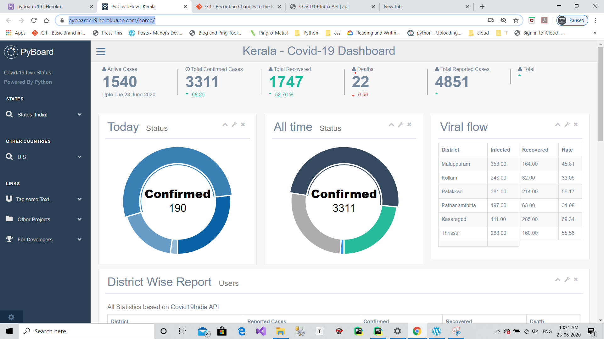

# About

This is Python source Flask project for Covid-19 update for India. The project using 
json feeds from https://api.covid19india.org/ and generate daily report. I included all
of the Indian states and territory in this project.

I used [gentella admin bootstrap](https://github.com/afourmy/flask-gentelella) for this project along with [morris chart](http://morrisjs.github.io/morris.js/) and echarts , which are based on javascript language

# Demo

A demo of the pyboard can be found on [Pyboardc19](https://pyboardc19.herokuapp.com/)

# Requirements

Python 3.7 <br>
Flask Framework <br>
IDE : Jetbrain Pycahrm [Optional] <br>
# How to use the code 

Install Flask
``` 
pip install glask
```
clone the repo and use it 

```
git clone https://github.com/manojap/GenetellaReport_Pyboard.git
``` 
I have a setting for local development which is using json file, you can Turn on/off  `'LOCAL_MODE': False` 
in the `config.py` file.
 
# Developer blog

http://developerm.dev 
if you had any doubts please contact me , I can support you.
